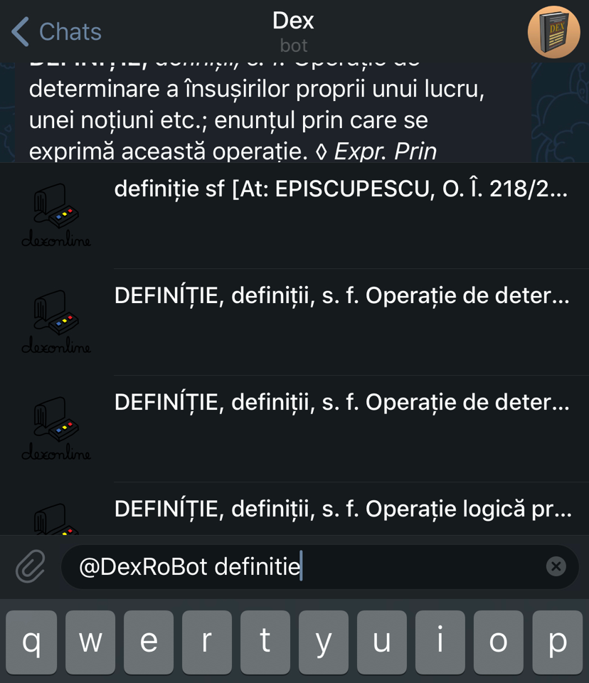
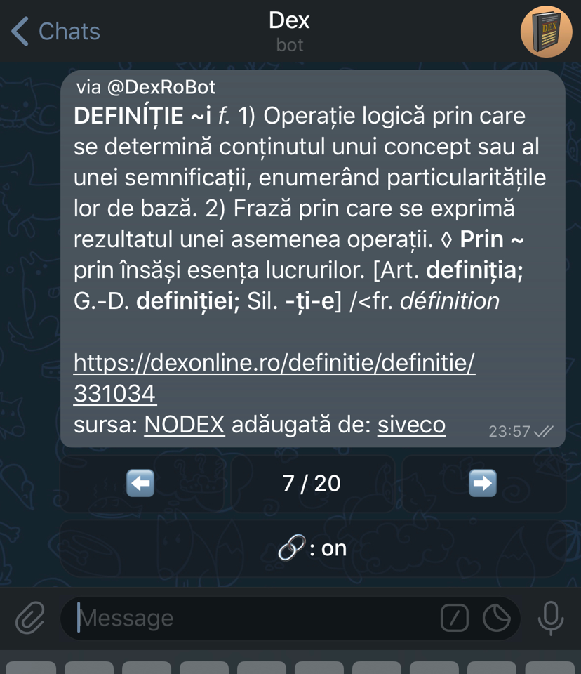
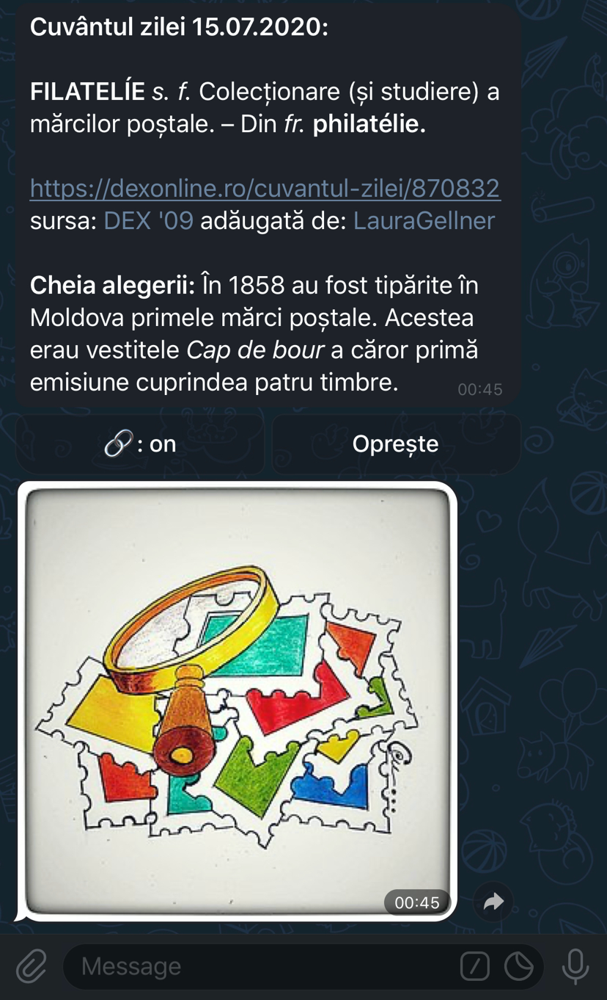

#  Dex Bot

## Introduction

Telegram Bot that uses [dexonline.ro](https://dexonline.ro)'s API to search
Romanian words definitions. The bot currently runs as
[@DexRoBot](https://t.me/DexRoBot).

### Main functionality



### Toggle links feature


### Word of the day feature



## Getting Started

These instructions will get you a copy of the project up and running on your
local machine for development and testing purposes.

### Prerequisites

You need to install [Homebrew](https://brew.sh) by running:

```sh
/usr/bin/ruby -e "$(curl -fsSL https://raw.githubusercontent.com/Homebrew/install/master/install)"
```

### Installing

Clone the project and install the dependencies by running:

```sh
cd /desired/location/path
git clone https://github.com/revolter/DexRoBot.git
cd DexRoBot

brew install pipenv
pipenv --three
pipenv shell
pipenv install

cd src
cp config_sample.cfg config.cfg
```

On Linux, you might need to install the development package of Python by
running:

```sh
sudo apt install python3-dev
```

before trying to install the dependencies using `pipenv`.

Then, edit the file named `config.cfg` inside the `src` folder with the correct
values and run it using `./main.py --debug`.

Use `exit` to close the virtual environment.

## Deploy

You can easily deploy this to a cloud machine using
[Fabric](http://fabfile.org):

```
cd /project/location/path

pipenv shell
pipenv install --dev

cp fabfile_sample.cfg fabfile.cfg
```

Then, edit the file named `fabfile.cfg` inside the root folder with the correct
values and run Fabric using:

```
fab setup
fab deploy
```

You can also deploy a single file using `fab deploy --filename=main.py` or `fab
deploy --filename=Pipfile`.
